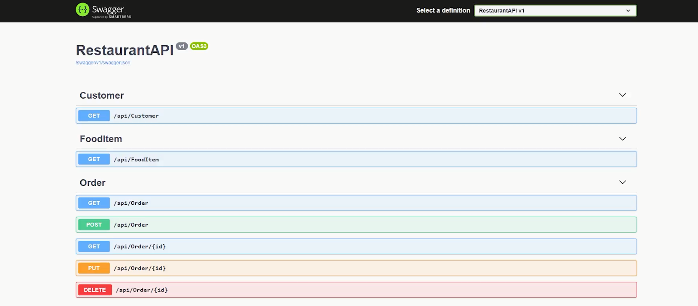

# Restaurant Management System Backend Setup Instructions

<p align="center">
  
</p>

## Demo
Watch the demo [here](https://youtu.be/F4qPKMhbDEw?si=T_UvjkeXKWgeqLOw)

## Technologies Used
- **Backend:** .NET Core 8
- **Database:** SQL Server
<br>
## Instructions
Follow these steps to set up and run the Restaurant Management System Backend:

1. **Clone the Repository**

2. **Configure SQL Server Connection:** Add your SQL Server database connection details in the `appsettings.json` file:
   ```json
   "AllowedHosts": "*",
   "ConnectionStrings": {
     "DevConnection": "Server=CYDEX;Database=RestaurantDB;Trusted_Connection=True;MultipleActiveResultSets=True;"
   }
   
   Replace YOUR_SERVER_NAME, YOUR_USERNAME, and YOUR_PASSWORD with your SQL Server details.

3. **Code-First Migration: Open the Package Manager Console and run the following command to create an initial migration:

   ```json
   
    Add-Migration -Name Initial3 -OutputDir "Data/Migrations"

4.  **Update Database: Apply the migration to update the SQL Server database:
            
     ```json
     
      Update-Database 


5.  **Run the Application: Start the application to ensure everything is set up correctly.
<br>
<br>
Frontend Instructoin : https://github.com/CydexCode/JuiceBarApplication
